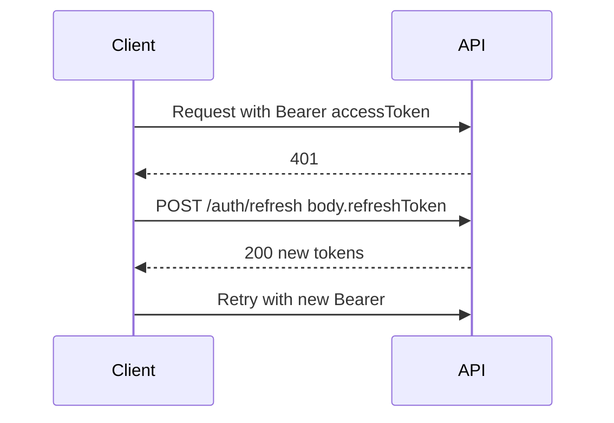

# Feature: Auth & user management (API)

## Summary

NestJS authentication and user administration: self-registration as `USER`, JWT access + refresh (refresh token bcrypt-hashed in DB), forgot/reset password, role-based guards (`ADMIN` / `USER` / `RESTAURANT_ADMIN`), admin-only user listing, admin creation, and restaurant-admin user creation. Default admin is created via Prisma seed (restaurant flows documented in [restaurant-module.md](restaurant-module.md)).

## Status

**complete** — API only; Next.js integration is future work.

## Scope

- **App(s):** `apps/api`
- **Out of scope:** guest/table orders, email delivery in production (reset flow logs in production until mailer exists).

## Key files

| File | Role |
|------|------|
| `apps/api/src/auth/auth.module.ts` | JwtModule, Passport, strategies |
| `apps/api/src/auth/auth.service.ts` | register, login, refresh, logout, forgot/reset password |
| `apps/api/src/auth/auth.controller.ts` | `/auth/*` routes |
| `apps/api/src/auth/strategies/jwt.strategy.ts` | Validates access JWT from `Authorization` header |
| `apps/api/src/auth/strategies/jwt-refresh.strategy.ts` | Validates refresh JWT from body `refreshToken` |
| `apps/api/src/auth/guards/jwt-auth.guard.ts` | `AuthGuard('jwt')` |
| `apps/api/src/auth/guards/jwt-refresh.guard.ts` | `AuthGuard('jwt-refresh')` |
| `apps/api/src/auth/guards/roles.guard.ts` | Enforces `@Roles()` vs `request.user.role` |
| `apps/api/src/auth/decorators/current-user.decorator.ts` | `@CurrentUser()` → `JwtUser` |
| `apps/api/src/auth/decorators/roles.decorator.ts` | `@Roles(Role.ADMIN)` |
| `apps/api/src/auth/dto/*.ts` | Request DTOs |
| `apps/api/src/auth/types/jwt-user.type.ts` | `JwtUser` shape on `request.user` |
| `apps/api/src/users/users.module.ts` | Users feature module |
| `apps/api/src/users/users.service.ts` | Profiles, list, create admin, role, soft-delete |
| `apps/api/src/users/users.controller.ts` | `/users/*` routes |
| `apps/api/src/users/dto/*.ts` | User/admin/restaurant-admin DTOs |
| `apps/api/prisma/schema.prisma` | `User` model, `Role` enum (includes `RESTAURANT_ADMIN`) |
| `apps/api/prisma/seed.ts` | Default admin |
| `apps/api/prisma.config.ts` | `migrations.seed` → `bun prisma/seed.ts` |
| `apps/api/test/auth.e2e-spec.ts` | E2E coverage |
| `apps/api/test/jest-e2e.setup.ts` | `dotenv` + default JWT secrets for e2e |

## Data model

```prisma
enum Role {
  ADMIN
  USER
  RESTAURANT_ADMIN
}

model User {
  id, email @unique, password, name, role @default(USER)
  refreshToken?, resetPasswordToken?, resetPasswordExpires?
  isActive @default(true)
  createdAt, updatedAt
}
```

**`UserProfile` (API responses):** all `User` fields except `password`, `refreshToken`, `resetPasswordToken` (may include `resetPasswordExpires` if present — usually null).

## JWT payload

Decoded access and refresh JWTs share the same claims:

```ts
interface JwtPayload {
  sub: string;   // user id (cuid)
  email: string;
  role: 'ADMIN' | 'USER' | 'RESTAURANT_ADMIN';
  iat: number;
  exp: number;
}
```

| Token | Lifetime | Transport |
|-------|----------|-----------|
| Access | 15 minutes | `Authorization: Bearer <accessToken>` |
| Refresh | 7 days | JSON body field `refreshToken` on `POST /auth/refresh` |

Refresh tokens are **stored bcrypt-hashed** in `User.refreshToken`. After logout or password reset, refresh is cleared server-side.

## API contract

Base path: no global prefix (e.g. `http://localhost:3001/auth/login`).

### `POST /auth/register`

- **Auth:** none  
- **Body:** `{ name: string; email: string; password: string }` — password min 8, must include upper, lower, digit.  
- **201:** `{ user: UserProfile; accessToken: string; refreshToken: string }`  
- **409:** email already registered  

### `POST /auth/login`

- **Auth:** none  
- **Body:** `{ email: string; password: string }`  
- **200:** `{ user: UserProfile; accessToken: string; refreshToken: string }`  
- **401:** invalid credentials or inactive user  

### `POST /auth/refresh`

- **Auth:** none (valid refresh JWT required in body)  
- **Body:** `{ refreshToken: string }` — must be the **JWT string** returned at login/register.  
- **200:** `{ accessToken: string; refreshToken: string }` (rotation)  
- **401/403:** invalid or revoked refresh  

### `POST /auth/logout`

- **Auth:** Bearer access JWT  
- **200:** `{ message: string }` — clears `refreshToken` in DB  

### `POST /auth/forgot-password`

- **Auth:** none  
- **Body:** `{ email: string }`  
- **200:** `{ message: string; resetToken?: string }` — always same success message; **`resetToken` only when `NODE_ENV !== 'production'`** (dev/test). In production, implement email; token is not returned in JSON.  

### `POST /auth/reset-password`

- **Auth:** none  
- **Body:** `{ token: string; newPassword: string }` (same password rules as register)  
- **200:** `{ message: string }`  
- **400:** invalid or expired token  

### `GET /users`

- **Auth:** Bearer + role `ADMIN`  
- **Query:** `page?` (default 1), `limit?` (default 20, max 100)  
- **200:** `{ data: UserProfile[]; total: number; page: number; limit: number }`  
- **401 / 403:** as usual  

### `GET /users/me`

- **Auth:** Bearer  
- **200:** `UserProfile`  
- **404:** user missing or inactive  

### `PATCH /users/me`

- **Auth:** Bearer  
- **Body:** `{ name?: string }`  
- **200:** `UserProfile`  

### `POST /users/admin`

- **Auth:** Bearer + `ADMIN`  
- **Body:** `{ name; email; password }` (same password rules)  
- **200:** `UserProfile` (new admin)  
- **409:** email exists  

### `PATCH /users/:id/role`

- **Auth:** Bearer + `ADMIN`  
- **Body:** `{ role: 'ADMIN' | 'USER' | 'RESTAURANT_ADMIN' }`  
- **200:** `UserProfile`  

### `POST /users/restaurant-admin`

- **Auth:** Bearer + `ADMIN`  
- **Body:** `{ name: string; email: string; password: string }` — same password rules as register  
- **201:** `UserProfile` (new user with `role: RESTAURANT_ADMIN`)  
- **409:** email exists  

### `DELETE /users/:id`

- **Auth:** Bearer + `ADMIN`  
- **200:** `{ message: string }` — sets `isActive: false`, clears refresh; if user was `RESTAURANT_ADMIN`, deletes all `RestaurantAdminAssignment` rows for that user (same transaction)  

## Token refresh flow (frontend)

1. Store `accessToken` (memory or sessionStorage) and `refreshToken` (prefer httpOnly cookie when you add BFF; otherwise secure storage).  
2. On **401** from an authenticated call, `POST /auth/refresh` with `{ refreshToken }`.  
3. Replace both tokens from the response.  
4. Retry the failed request with the new `Authorization` header.  
5. If `/auth/refresh` fails with 401/403, treat session as ended → login page.  



## Forgot / reset password flow

1. `POST /auth/forgot-password` with `{ email }`.  
2. Show generic “check your inbox” UI (do not reveal whether email exists).  
3. In dev, use `resetToken` from response; in prod, deep-link with token from email.  
4. `POST /auth/reset-password` with `{ token, newPassword }`.  
5. Redirect to login. Reset tokens expire in **1 hour**.  

## Role-based access (frontend)

- Read `role` from login/register `user` or decode access JWT (e.g. `jwt-decode`).  
- Hide/disable admin UI when `role !== 'ADMIN'`; restaurant-admin UI when `role !== 'RESTAURANT_ADMIN'` for scoped dashboards.  
- **Backend always enforces** roles; frontend checks are UX only.  

## Guards & decorators (backend)

```ts
@UseGuards(JwtAuthGuard)
@Get('me')
getMe(@CurrentUser() user: JwtUser) { ... }

@UseGuards(JwtAuthGuard, RolesGuard)
@Roles(Role.ADMIN)
@Get()
list() { ... }
```

## Environment variables

| Variable | Purpose |
|----------|---------|
| `JWT_SECRET` | Signs access JWTs |
| `JWT_REFRESH_SECRET` | Signs refresh JWTs (must be different) |
| `DATABASE_URL` | PostgreSQL |
| `NODE_ENV` | `production` hides `resetToken` in forgot-password response |

## Default admin (seed)

- **Email:** `admin@spiceme.com`  
- **Password:** `Admin@123`  
- **Command:** `cd apps/api && bunx prisma db seed` (also configured in `prisma.config.ts` `migrations.seed`)  
- Change in production immediately.  

## Gotchas

- Never return `password`, `refreshToken`, or `resetPasswordToken` in JSON — services strip via `toProfile` / omit.  
- `POST /auth/refresh` expects the **JWT** string in `refreshToken`, not the bcrypt hash from DB.  
- ESM: Nest source imports use **`.js`** extensions in relative paths.  
- `forgot-password` returns **200** even if email is unknown (anti-enumeration).  
- Unit tests import `jest` from `@jest/globals` (Jest 30 ESM). E2E uses real Prisma (`jest-e2e.json` does not mock the generated client).  
- Ensure local `.env` includes `JWT_SECRET` and `JWT_REFRESH_SECRET` before `bun run dev` (see `.env.example`).  

## Frontend integration checklist

- [ ] Persist `accessToken` + `refreshToken` after register/login.  
- [ ] Attach `Authorization: Bearer <accessToken>` on protected requests.  
- [ ] On 401, call `/auth/refresh`, update tokens, retry once.  
- [ ] Decode JWT or use `user.role` for admin UI.  
- [ ] Logout: `POST /auth/logout` then clear client tokens.  
- [ ] Forgot password: submit email → generic success message.  
- [ ] Reset password: token (query param) + new password → login.  

## Dependencies on other features

- PostgreSQL + migrations applied (`User` table).  
- Future: SMTP or transactional email for production reset links.  
