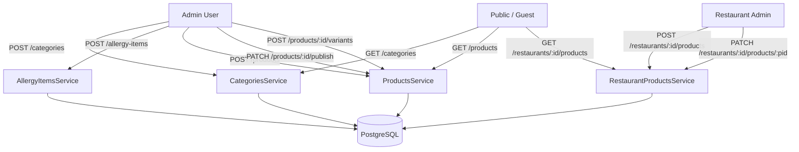
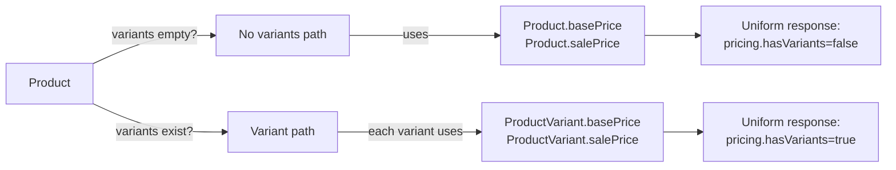

# Product Management — Backend Implementation Guide

> **Branch:** `feat/backend-product-management-module`  
> **Scope:** NestJS API only (`apps/api`). Frontend is future work.  
> **Stack conventions:** ESM project — all relative TS imports use `.js` extensions. Guards, decorators, and Prisma patterns follow existing `restaurants` module exactly.

---

## 0. Read before coding

- Architecture: `.cursor/context/architecture.md`
- Backend setup: `.cursor/context/features/backend-setup.md`
- Restaurant module (auth patterns): `.cursor/context/features/restaurant-module.md`
- NestJS rules: `.cursor/rules/nestjs-standards.mdc`

Prisma client is imported from `../../generated/prisma/client.js` and enums from `../../generated/prisma/enums.js`.

---

## Step 1 — Prisma schema

Edit `apps/api/prisma/schema.prisma`. Add the following models **after** the existing `RestaurantAdminAssignment` model. Also add the `restaurantProducts` relation field to the existing `Restaurant` model.

### 1a. Add relation to existing `Restaurant` model

```prisma
model Restaurant {
  // ...existing fields unchanged...
  adminAssignments   RestaurantAdminAssignment[]
  restaurantProducts RestaurantProduct[]           // ← add this line
}
```

### 1b. New models to append

```prisma
model Category {
  id            String      @id @default(cuid())
  name          String      @unique
  description   String?
  imageUrl      String?
  sortOrder     Int         @default(0)
  isActive      Boolean     @default(true)
  createdAt     DateTime    @default(now())
  updatedAt     DateTime    @updatedAt

  subCategories SubCategory[]
  products      Product[]
}

model SubCategory {
  id          String   @id @default(cuid())
  name        String
  description String?
  imageUrl    String?
  categoryId  String
  sortOrder   Int      @default(0)
  isActive    Boolean  @default(true)
  createdAt   DateTime @default(now())
  updatedAt   DateTime @updatedAt

  category Category  @relation(fields: [categoryId], references: [id], onDelete: Restrict)
  products Product[]

  @@unique([name, categoryId])
}

model AllergyItem {
  id          String   @id @default(cuid())
  name        String   @unique
  description String?
  iconUrl     String?
  createdAt   DateTime @default(now())
  updatedAt   DateTime @updatedAt

  products ProductAllergyItem[]
}

model Product {
  id            String   @id @default(cuid())
  title         String
  description   String
  imageUrl      String
  categoryId    String
  subCategoryId String?
  isPublished   Boolean  @default(false)
  isActive      Boolean  @default(true)
  basePrice     Decimal? @db.Decimal(10, 2)
  salePrice     Decimal? @db.Decimal(10, 2)
  createdAt     DateTime @default(now())
  updatedAt     DateTime @updatedAt

  category           Category             @relation(fields: [categoryId], references: [id], onDelete: Restrict)
  subCategory        SubCategory?         @relation(fields: [subCategoryId], references: [id], onDelete: SetNull)
  variants           ProductVariant[]
  allergyItems       ProductAllergyItem[]
  restaurantProducts RestaurantProduct[]
  ingredients        ProductIngredient[]
}

model ProductVariant {
  id        String   @id @default(cuid())
  productId String
  name      String
  sortOrder Int      @default(0)
  basePrice Decimal  @db.Decimal(10, 2)
  salePrice Decimal? @db.Decimal(10, 2)
  isActive  Boolean  @default(true)
  createdAt DateTime @default(now())
  updatedAt DateTime @updatedAt

  product Product @relation(fields: [productId], references: [id], onDelete: Cascade)

  @@unique([productId, name])
}

model ProductAllergyItem {
  productId     String
  allergyItemId String

  product     Product     @relation(fields: [productId], references: [id], onDelete: Cascade)
  allergyItem AllergyItem @relation(fields: [allergyItemId], references: [id], onDelete: Cascade)

  @@id([productId, allergyItemId])
}

model RestaurantProduct {
  id           String   @id @default(cuid())
  restaurantId String
  productId    String
  isAvailable  Boolean  @default(true)
  addedAt      DateTime @default(now())
  updatedAt    DateTime @updatedAt

  restaurant Restaurant @relation(fields: [restaurantId], references: [id], onDelete: Cascade)
  product    Product    @relation(fields: [productId], references: [id], onDelete: Cascade)

  @@unique([restaurantId, productId])
}

// ─── Future: ingredient / sub-product customisation ─────────────────────────
// Schema is defined now; no controller or service API is built yet.
// These models let restaurant admins later let customers add/exclude ingredients.

model Ingredient {
  id          String   @id @default(cuid())
  name        String   @unique
  description String?
  isAllergen  Boolean  @default(false)
  createdAt   DateTime @default(now())
  updatedAt   DateTime @updatedAt

  productIngredients ProductIngredient[]
}

model ProductIngredient {
  id           String   @id @default(cuid())
  productId    String
  ingredientId String
  isDefault    Boolean  @default(true)
  canExclude   Boolean  @default(false)
  canAdd       Boolean  @default(false)
  extraPrice   Decimal? @db.Decimal(10, 2)

  product    Product    @relation(fields: [productId], references: [id], onDelete: Cascade)
  ingredient Ingredient @relation(fields: [ingredientId], references: [id])

  @@unique([productId, ingredientId])
}
```

### 1c. Run migration

```bash
cd apps/api
bunx prisma migrate dev --name add-product-management
bunx prisma generate
```

---

## Step 2 — CategoriesModule

Create directory `apps/api/src/categories/` with `dto/` subdirectory.

### 2a. DTOs

**`dto/create-category.dto.ts`**
```ts
import { ApiProperty, ApiPropertyOptional } from '@nestjs/swagger';
import { IsInt, IsOptional, IsString, Min, MinLength } from 'class-validator';

export class CreateCategoryDto {
  @ApiProperty({ example: 'Pizza' })
  @IsString()
  @MinLength(2)
  name: string;

  @ApiPropertyOptional()
  @IsOptional()
  @IsString()
  description?: string;

  @ApiPropertyOptional()
  @IsOptional()
  @IsString()
  imageUrl?: string;

  @ApiPropertyOptional({ default: 0 })
  @IsOptional()
  @IsInt()
  @Min(0)
  sortOrder?: number;
}
```

**`dto/update-category.dto.ts`**
```ts
import { PartialType } from '@nestjs/swagger';
import { IsBoolean, IsOptional } from 'class-validator';
import { CreateCategoryDto } from './create-category.dto.js';

export class UpdateCategoryDto extends PartialType(CreateCategoryDto) {
  @IsOptional()
  @IsBoolean()
  isActive?: boolean;
}
```

**`dto/create-subcategory.dto.ts`** — identical structure to `CreateCategoryDto` (same fields, same validators).

**`dto/update-subcategory.dto.ts`** — extends `PartialType(CreateSubCategoryDto)` and adds `@IsOptional() @IsBoolean() isActive?: boolean`.

### 2b. Service — `categories.service.ts`

Import: `PrismaService`, `Injectable`, `NotFoundException`, `ConflictException`, `BadRequestException` from NestJS.

Inject `PrismaService` via constructor.

Use the same **P2002 helpers** (`isPrismaUniqueViolation`, `uniqueConstraintFieldsFromMeta`) that exist in `restaurants.service.ts` — copy them verbatim into this service.

**Methods to implement:**

| Method | Logic |
|--------|-------|
| `findAll()` | `prisma.category.findMany({ orderBy: { sortOrder: 'asc' }, include: { _count: { select: { subCategories: true, products: true } } } })` |
| `findOne(id)` | `prisma.category.findUnique({ where: { id }, include: { subCategories: { orderBy: { sortOrder: 'asc' } } } })` — throw `NotFoundException` if `null` |
| `create(dto)` | `prisma.category.create({ data: { name: dto.name.trim(), description: dto.description, imageUrl: dto.imageUrl, sortOrder: dto.sortOrder ?? 0 } })` — wrap in try/catch, call `handleUniqueViolation` on P2002 |
| `update(id, dto)` | `findUnique` first → 404 if missing; then `prisma.category.update` with only defined dto fields (use spread conditionals like restaurants service) — try/catch for P2002 |
| `remove(id)` | Check `prisma.product.count({ where: { categoryId: id } })` → if > 0 throw `ConflictException('Category has products and cannot be deleted')`. Then `prisma.category.delete({ where: { id } })`. Return `{ message: 'Category deleted' }` |
| `createSubCategory(categoryId, dto)` | Find category first (404 if missing). Then `prisma.subCategory.create(...)`. P2002 on `[name, categoryId]` → `ConflictException('A subcategory with this name already exists in this category')` |
| `updateSubCategory(categoryId, subId, dto)` | Find subCategory where `id = subId AND categoryId = categoryId` → 404 if missing. Then `prisma.subCategory.update(...)`. P2002 → `ConflictException` |
| `removeSubCategory(categoryId, subId)` | Check `prisma.product.count({ where: { subCategoryId: subId } })` → if > 0 throw `ConflictException`. Then delete. Return `{ message: 'SubCategory deleted' }` |

### 2c. Controller — `categories.controller.ts`

```
@ApiTags('categories')
@Controller('categories')
```

Declare routes in this exact order (static before `:id`):

```
GET  /categories                            → public, no guards
POST /categories                            → JwtAuthGuard + RolesGuard + @Roles(Role.ADMIN)
GET  /categories/:id                        → public
PATCH /categories/:id                       → JwtAuthGuard + RolesGuard + @Roles(Role.ADMIN)
DELETE /categories/:id                      → JwtAuthGuard + RolesGuard + @Roles(Role.ADMIN)
POST /categories/:id/subcategories          → JwtAuthGuard + RolesGuard + @Roles(Role.ADMIN), @HttpCode(201)
PATCH /categories/:id/subcategories/:subId  → JwtAuthGuard + RolesGuard + @Roles(Role.ADMIN)
DELETE /categories/:id/subcategories/:subId → JwtAuthGuard + RolesGuard + @Roles(Role.ADMIN)
```

All ADMIN routes must have `@ApiBearerAuth('access-token')` and `@ApiOperation({ summary: '...' })`.

### 2d. Module — `categories.module.ts`

```ts
@Module({
  controllers: [CategoriesController],
  providers: [CategoriesService, RolesGuard],
  exports: [CategoriesService],
})
export class CategoriesModule {}
```

---

## Step 3 — AllergyItemsModule

Create `apps/api/src/allergy-items/` with `dto/` subdirectory.

### 3a. DTOs

**`dto/create-allergy-item.dto.ts`**
```ts
export class CreateAllergyItemDto {
  @ApiProperty({ example: 'Gluten' })
  @IsString()
  @MinLength(2)
  name: string;

  @ApiPropertyOptional()
  @IsOptional()
  @IsString()
  description?: string;

  @ApiPropertyOptional({ description: 'URL of an icon image' })
  @IsOptional()
  @IsString()
  iconUrl?: string;
}
```

**`dto/update-allergy-item.dto.ts`** — `extends PartialType(CreateAllergyItemDto)`, no extra fields.

### 3b. Service — `allergy-items.service.ts`

| Method | Logic |
|--------|-------|
| `findAll()` | `prisma.allergyItem.findMany({ orderBy: { name: 'asc' } })` |
| `findOne(id)` | `findUnique({ where: { id } })` → 404 if null |
| `create(dto)` | `prisma.allergyItem.create(...)` — P2002 on `name` → `ConflictException('An allergy item with this name already exists')` |
| `update(id, dto)` | `findUnique` → 404; then `update` — P2002 → `ConflictException` |
| `remove(id)` | `findUnique` → 404; then `prisma.allergyItem.delete(...)`. Return `{ message: 'Allergy item deleted' }`. Note: `ProductAllergyItem` records cascade-delete automatically. |

### 3c. Controller — `allergy-items.controller.ts`

```
@ApiTags('allergy-items')
@Controller('allergy-items')
```

```
GET    /allergy-items     → public
GET    /allergy-items/:id → public
POST   /allergy-items     → ADMIN
PATCH  /allergy-items/:id → ADMIN
DELETE /allergy-items/:id → ADMIN
```

### 3d. Module — `allergy-items.module.ts`

Same pattern as categories: register controller, service, RolesGuard; export service.

---

## Step 4 — ProductsModule

Create `apps/api/src/products/` with `dto/` subdirectory.

### 4a. DTOs

**`dto/create-product.dto.ts`**
```ts
export class CreateProductDto {
  @ApiProperty() @IsString() @MinLength(2) title: string;
  @ApiProperty() @IsString() @MinLength(10) description: string;
  @ApiProperty({ description: 'URL of product image' }) @IsString() imageUrl: string;
  @ApiProperty() @IsString() categoryId: string;
  @ApiPropertyOptional() @IsOptional() @IsString() subCategoryId?: string;

  // basePrice and salePrice are optional at creation time.
  // They are REQUIRED before the product can be published (if no variants exist).
  @ApiPropertyOptional({ type: Number, example: 15.99 })
  @IsOptional()
  @IsNumber({ maxDecimalPlaces: 2 })
  @Min(0)
  basePrice?: number;

  @ApiPropertyOptional({ type: Number, example: 12.99 })
  @IsOptional()
  @IsNumber({ maxDecimalPlaces: 2 })
  @Min(0)
  salePrice?: number;
}
```

**`dto/update-product.dto.ts`** — `extends PartialType(CreateProductDto)`.

**`dto/list-products-query.dto.ts`**
```ts
import { Type } from 'class-transformer';

export class ListProductsQueryDto {
  @IsOptional() @Type(() => Number) @IsInt() @Min(1) page?: number;
  @IsOptional() @Type(() => Number) @IsInt() @Min(1) @Max(100) limit?: number;
  @IsOptional() @IsString() categoryId?: string;
  @IsOptional() @IsString() subCategoryId?: string;
}
```

**`dto/create-variant.dto.ts`**
```ts
export class CreateVariantDto {
  @ApiProperty({ example: 'Large' }) @IsString() @MinLength(1) name: string;
  @ApiPropertyOptional({ default: 0 }) @IsOptional() @IsInt() @Min(0) sortOrder?: number;
  @ApiProperty({ example: 17.99 }) @IsNumber({ maxDecimalPlaces: 2 }) @Min(0) basePrice: number;
  @ApiPropertyOptional({ example: 14.99 }) @IsOptional() @IsNumber({ maxDecimalPlaces: 2 }) @Min(0) salePrice?: number;
}
```

**`dto/update-variant.dto.ts`** — `extends PartialType(CreateVariantDto)`.

**`dto/update-product-publish.dto.ts`**
```ts
export class UpdateProductPublishDto {
  @ApiProperty() @IsBoolean() isPublished: boolean;
}
```

**`dto/add-allergy-items.dto.ts`**
```ts
export class AddAllergyItemsDto {
  @ApiProperty({ type: [String] })
  @IsArray()
  @IsString({ each: true })
  allergyItemIds: string[];
}
```

### 4b. Service — `products.service.ts`

#### 4b-i. Response type

Export a `ProductProfile` type that the controller and other modules can import:

```ts
export type ProductVariantProfile = {
  id: string; name: string; sortOrder: number;
  basePrice: string; salePrice: string | null; isActive: boolean;
};

export type ProductProfile = {
  id: string; title: string; description: string; imageUrl: string;
  categoryId: string; subCategoryId: string | null;
  isPublished: boolean; isActive: boolean;
  category: { id: string; name: string };
  subCategory: { id: string; name: string } | null;
  pricing: {
    hasVariants: boolean;
    basePrice: string | null;
    salePrice: string | null;
    variants: ProductVariantProfile[];
  };
  allergyItems: Array<{ id: string; name: string; iconUrl: string | null }>;
  createdAt: Date; updatedAt: Date;
};
```

#### 4b-ii. `toProfile` helper

Converts a raw Prisma product row (with `include: { category, subCategory, variants, allergyItems: { include: { allergyItem: true } } }`) into `ProductProfile`. Key points:
- `Decimal` fields from Prisma must be converted with `.toString()`.
- `pricing.hasVariants = product.variants.filter(v => v.isActive).length > 0`.
- `allergyItems` is mapped from `product.allergyItems.map(pai => pai.allergyItem)`.

#### 4b-iii. Standard P2002 helpers

Copy `isPrismaUniqueViolation` and `uniqueConstraintFieldsFromMeta` from `RestaurantsService`.

#### 4b-iv. Standard Prisma include object

Define a private constant (or inline) for full product include:

```ts
const PRODUCT_INCLUDE = {
  category: { select: { id: true, name: true } },
  subCategory: { select: { id: true, name: true } },
  variants: { orderBy: { sortOrder: 'asc' as const } },
  allergyItems: { include: { allergyItem: true } },
} as const;
```

#### 4b-v. Service methods

| Method | Signature | Logic |
|--------|-----------|-------|
| `create(dto)` | `async create(dto: CreateProductDto): Promise<ProductProfile>` | Verify `categoryId` exists (404). If `subCategoryId` provided, verify it exists AND belongs to `categoryId` (400 if mismatch). Create product. Return `toProfile(created)`. |
| `findAll(query, adminView)` | `async findAll(query: ListProductsQueryDto, adminView: boolean)` | Build `where` clause: if `!adminView` add `isPublished: true, isActive: true`. Add `categoryId` and `subCategoryId` filters if provided. Paginate (`page`, `limit` default 1 and 20). Return `{ data, total, page, limit }`. |
| `findOne(id, adminView)` | `async findOne(id: string, adminView: boolean): Promise<ProductProfile>` | `findUnique` with `PRODUCT_INCLUDE`. Throw 404 if null. If `!adminView` and `(!product.isPublished \|\| !product.isActive)` throw 404. Return `toProfile`. |
| `update(id, dto)` | `async update(id: string, dto: UpdateProductDto): Promise<ProductProfile>` | `findUnique` → 404. If `subCategoryId` changed, verify it belongs to the category (use new `categoryId` or existing one). Update with only defined dto fields. Return `toProfile`. |
| `publish(id, dto)` | `async publish(id: string, dto: UpdateProductPublishDto): Promise<ProductProfile>` | `findUnique` with variants included → 404. If `!product.isActive` throw `BadRequestException('Cannot publish an inactive product')`. If `dto.isPublished === true`: check `product.basePrice !== null \|\| activeVariants.length > 0`; if both false throw `BadRequestException('Product must have a base price or at least one active variant before publishing')`. Update `isPublished`. Return `toProfile`. |
| `softDelete(id)` | `async softDelete(id: string): Promise<{ message: string }>` | `findUnique` → 404. `update({ isActive: false, isPublished: false })`. Return `{ message: 'Product deleted' }`. |
| `addVariant(id, dto)` | `async addVariant(id: string, dto: CreateVariantDto): Promise<ProductProfile>` | `findUnique` → 404. `prisma.productVariant.create({ data: { productId: id, name: dto.name, sortOrder: dto.sortOrder ?? 0, basePrice: dto.basePrice, salePrice: dto.salePrice } })`. P2002 on `[productId, name]` → `ConflictException('A variant with this name already exists for this product')`. Fetch and return full product via `toProfile`. |
| `updateVariant(id, variantId, dto)` | `async updateVariant(id: string, variantId: string, dto: UpdateVariantDto): Promise<ProductProfile>` | Find variant where `id = variantId AND productId = id` → 404 if missing. Update with defined dto fields. P2002 on name → `ConflictException`. Fetch full product. Return `toProfile`. |
| `removeVariant(id, variantId)` | `async removeVariant(id: string, variantId: string): Promise<ProductProfile>` | Find variant (404 if missing). Count remaining active variants after removal: if `activeVariantCount - 1 === 0` check `product.basePrice !== null`; if also null throw `BadRequestException('Cannot remove the last variant from a product without a base price. Set a base price first.')`. Delete variant. Fetch full product. Return `toProfile`. |
| `addAllergyItems(id, dto)` | `async addAllergyItems(id: string, dto: AddAllergyItemsDto): Promise<ProductProfile>` | `findUnique` → 404. Verify all `allergyItemIds` exist in `allergyItem` table (batch `findMany({ where: { id: { in: dto.allergyItemIds } } })`; if count differs throw `BadRequestException('One or more allergy item IDs are invalid')`). `prisma.productAllergyItem.createMany({ data: dto.allergyItemIds.map(aid => ({ productId: id, allergyItemId: aid })), skipDuplicates: true })`. Fetch full product. Return `toProfile`. |
| `removeAllergyItem(id, allergyItemId)` | `async removeAllergyItem(id: string, allergyItemId: string): Promise<ProductProfile>` | Find join record → 404 if missing. Delete. Fetch full product. Return `toProfile`. |

### 4c. Controller — `products.controller.ts`

```
@ApiTags('products')
@Controller('products')
```

**Declare routes in this exact order** (NestJS matches in declaration order; specific paths before wildcards):

```
GET  /products/all                              → JwtAuthGuard + RolesGuard + @Roles(ADMIN)
GET  /products                                  → public (no guards); calls service.findAll(query, false)
POST /products                                  → ADMIN; @HttpCode(201)
GET  /products/:id                              → optional auth: if request has Bearer token and role=ADMIN → adminView=true; otherwise adminView=false
PATCH /products/:id/publish                     → ADMIN
PATCH /products/:id                             → ADMIN
DELETE /products/:id                            → ADMIN
POST /products/:id/variants                     → ADMIN; @HttpCode(201)
PATCH /products/:id/variants/:variantId         → ADMIN
DELETE /products/:id/variants/:variantId        → ADMIN
POST /products/:id/allergy-items                → ADMIN; @HttpCode(201)
DELETE /products/:id/allergy-items/:allergyItemId → ADMIN
```

**`GET /products/:id` optional auth pattern:**
```ts
@Get(':id')
@ApiOperation({ summary: 'Get product by id' })
async getOne(
  @Param('id') id: string,
  @Request() req: { user?: JwtUser },
): Promise<ProductProfile> {
  const isAdmin = req.user?.role === Role.ADMIN;
  return this.productsService.findOne(id, isAdmin);
}
```
Note: no guard is applied to this route, so `req.user` will be populated only if the client sends a valid Bearer token that NestJS passport passthrough decodes. Use `@UseGuards(JwtAuthGuard)` with `{ optional: true }` — check how the existing codebase handles this. If the existing codebase does not have optional JWT, simply expose this route publicly with `adminView = false` (the ADMIN already has `/products/all`).

### 4d. Module — `products.module.ts`

```ts
@Module({
  controllers: [ProductsController],
  providers: [ProductsService, RolesGuard],
  exports: [ProductsService],
})
export class ProductsModule {}
```

---

## Step 5 — RestaurantProductsModule

Create `apps/api/src/restaurant-products/` with `dto/` subdirectory.

### 5a. DTOs

**`dto/add-restaurant-product.dto.ts`**
```ts
export class AddRestaurantProductDto {
  @ApiProperty() @IsString() productId: string;
}
```

**`dto/update-restaurant-product.dto.ts`**
```ts
export class UpdateRestaurantProductDto {
  @ApiProperty() @IsBoolean() isAvailable: boolean;
}
```

### 5b. Service — `restaurant-products.service.ts`

Inject `PrismaService` only (no circular dependency on `RestaurantsService`).

#### Ownership guard helper (private method)

```ts
private async assertRestaurantAccess(restaurantId: string, userId: string): Promise<void> {
  const assignment = await this.prisma.restaurantAdminAssignment.findFirst({
    where: { restaurantId, userId },
  });
  if (!assignment) {
    throw new ForbiddenException('You are not assigned to this restaurant');
  }
}
```

Call this at the top of every mutation method, passing `currentUser.userId`.

#### Service methods

| Method | Logic |
|--------|-------|
| `findAvailable(restaurantId)` | Verify restaurant exists → 404. `prisma.restaurantProduct.findMany({ where: { restaurantId, isAvailable: true, product: { isPublished: true, isActive: true } }, include: { product: { include: PRODUCT_INCLUDE_LITE } } })`. Return array of products. |
| `addProduct(restaurantId, dto, currentUser)` | `assertRestaurantAccess(restaurantId, currentUser.userId)`. Find restaurant → 404. Find product → 404 if not found OR `!product.isPublished` (`BadRequestException('Product is not published')`). Create `RestaurantProduct`. P2002 on `[restaurantId, productId]` → `ConflictException('Product is already added to this restaurant')`. Return the created record. |
| `updateAvailability(restaurantId, productId, dto, currentUser)` | `assertRestaurantAccess`. Find `RestaurantProduct` by `{ restaurantId, productId }` → 404 if missing. `prisma.restaurantProduct.update({ where: { id: link.id }, data: { isAvailable: dto.isAvailable } })`. Return updated record. |
| `removeProduct(restaurantId, productId, currentUser)` | `assertRestaurantAccess`. Find link → 404. `prisma.restaurantProduct.delete({ where: { id: link.id } })`. Return `{ message: 'Product removed from restaurant' }`. |

`PRODUCT_INCLUDE_LITE` is a minimal include for listing (omit heavy relations if needed):
```ts
const PRODUCT_INCLUDE_LITE = {
  category: { select: { id: true, name: true } },
  subCategory: { select: { id: true, name: true } },
  variants: { where: { isActive: true }, orderBy: { sortOrder: 'asc' as const } },
  allergyItems: { include: { allergyItem: true } },
} as const;
```

### 5c. Controller — `restaurant-products.controller.ts`

```
@ApiTags('restaurant-products')
@Controller('restaurants/:restaurantId/products')
```

```
GET    /restaurants/:restaurantId/products             → public
POST   /restaurants/:restaurantId/products             → JwtAuthGuard + RolesGuard + @Roles(RESTAURANT_ADMIN); @HttpCode(201)
PATCH  /restaurants/:restaurantId/products/:productId → JwtAuthGuard + RolesGuard + @Roles(RESTAURANT_ADMIN)
DELETE /restaurants/:restaurantId/products/:productId → JwtAuthGuard + RolesGuard + @Roles(RESTAURANT_ADMIN)
```

The `@CurrentUser() user: JwtUser` decorator is available on RESTAURANT_ADMIN routes; pass `user` into every service mutation call.

### 5d. Module — `restaurant-products.module.ts`

```ts
@Module({
  controllers: [RestaurantProductsController],
  providers: [RestaurantProductsService, RolesGuard],
})
export class RestaurantProductsModule {}
```

---

## Step 6 — Register in AppModule

Edit `apps/api/src/app.module.ts` — add four imports:

```ts
import { CategoriesModule } from './categories/categories.module.js';
import { AllergyItemsModule } from './allergy-items/allergy-items.module.js';
import { ProductsModule } from './products/products.module.js';
import { RestaurantProductsModule } from './restaurant-products/restaurant-products.module.js';

@Module({
  imports: [
    ConfigModule.forRoot({ isGlobal: true, envFilePath: ['.env.local', '.env'] }),
    PrismaModule,
    AuthModule,
    UsersModule,
    RestaurantsModule,
    CategoriesModule,       // ← new
    AllergyItemsModule,     // ← new
    ProductsModule,          // ← new
    RestaurantProductsModule, // ← new
  ],
  ...
})
```

---

## Step 7 — Unit Tests

Pattern (identical to `restaurants.service.spec.ts`):
- Import `jest`, `describe`, `it`, `expect`, `beforeEach`, `afterEach` from `'@jest/globals'`.
- Mock `PrismaService` with a plain object (`const prisma = { modelName: { findUnique: jest.fn(), ... }, $transaction: jest.fn() }`).
- `prisma.$transaction.mockImplementation(async (fn) => fn(prisma))`.
- Create the `TestingModule` in `beforeEach` using `{ provide: PrismaService, useValue: prisma }`.
- Call `jest.clearAllMocks()` in both `beforeEach` and `afterEach`.

### 7a. `categories.service.spec.ts`

Place at `apps/api/src/categories/categories.service.spec.ts`.

Prisma mock needs: `category.findMany`, `category.findUnique`, `category.create`, `category.update`, `category.delete`, `subCategory.create`, `subCategory.findUnique`, `subCategory.update`, `subCategory.delete`, `product.count`.

| `describe` block | Test cases |
|-----------------|------------|
| `findAll` | Returns array; `_count` is included. |
| `findOne` | Returns category when found. Throws `NotFoundException` when null. |
| `create` | Creates and returns category. Throws `ConflictException` on P2002 with `name` field. |
| `update` | Updates with only defined dto fields. Throws `NotFoundException` when category missing. Throws `ConflictException` on P2002 name conflict. |
| `remove` | Throws `ConflictException` when `product.count > 0`. Deletes and returns message when count is 0. |
| `createSubCategory` | Throws `NotFoundException` when category not found. Creates and returns subCategory. Throws `ConflictException` on P2002. |
| `updateSubCategory` | Throws `NotFoundException` when subCategory not found. Updates. |
| `removeSubCategory` | Throws `ConflictException` when products use it. Deletes otherwise. |

### 7b. `allergy-items.service.spec.ts`

Place at `apps/api/src/allergy-items/allergy-items.service.spec.ts`.

Prisma mock needs: `allergyItem.findMany`, `allergyItem.findUnique`, `allergyItem.create`, `allergyItem.update`, `allergyItem.delete`.

| `describe` | Tests |
|-----------|-------|
| `findAll` | Returns all items ordered by name. |
| `findOne` | Returns item. Throws `NotFoundException` when null. |
| `create` | Creates and returns. Throws `ConflictException` on P2002 `name`. |
| `update` | Updates. Throws `NotFoundException`. Throws `ConflictException` on P2002 name conflict. |
| `remove` | Deletes. Throws `NotFoundException` when not found. Returns `{ message }`. |

### 7c. `products.service.spec.ts`

Place at `apps/api/src/products/products.service.spec.ts`.

Prisma mock needs: `product.findUnique`, `product.findMany`, `product.count`, `product.create`, `product.update`, `productVariant.findFirst`, `productVariant.create`, `productVariant.update`, `productVariant.delete`, `productVariant.count`, `productAllergyItem.createMany`, `productAllergyItem.findFirst`, `productAllergyItem.delete`, `category.findUnique`, `subCategory.findUnique`, `allergyItem.findMany`.

Define a `baseProduct` fixture with all fields including nested `category`, `subCategory`, `variants: []`, `allergyItems: []`.

| `describe` | Tests |
|-----------|-------|
| `create` | Creates with valid `categoryId`. Throws `NotFoundException` when category not found. Throws `BadRequestException` when `subCategoryId` does not belong to `categoryId`. |
| `findAll` | `adminView=false` passes `isPublished: true, isActive: true` in `where`. `adminView=true` omits those filters. Applies `categoryId` filter when provided. Returns `{ data, total, page, limit }`. |
| `findOne` | Returns product when found and `adminView=true`. Throws `NotFoundException` when not found. Throws `NotFoundException` when `adminView=false` and product is unpublished. |
| `update` | Partial update. Throws `NotFoundException`. Throws `BadRequestException` when `subCategoryId` does not match category. |
| `publish` | `isPublished=true` succeeds when `basePrice` is set. `isPublished=true` succeeds when at least one active variant exists. `isPublished=true` throws `BadRequestException` when no `basePrice` and no variants. Throws `NotFoundException`. Throws `BadRequestException` if `product.isActive=false`. |
| `softDelete` | Sets `isActive: false` and `isPublished: false`. Throws `NotFoundException`. |
| `addVariant` | Calls `productVariant.create` with correct data. Throws `NotFoundException` when product not found. Throws `ConflictException` on P2002 `[productId, name]`. |
| `updateVariant` | Updates. Throws `NotFoundException` when variant not found. |
| `removeVariant` | Deletes when `basePrice` set. Deletes when other active variants remain. Throws `BadRequestException` when last variant and no `basePrice`. Throws `NotFoundException` when variant not found. |
| `addAllergyItems` | Calls `createMany` with `skipDuplicates`. Throws `BadRequestException` when some allergyItemIds are invalid. Throws `NotFoundException` when product not found. |
| `removeAllergyItem` | Deletes join. Throws `NotFoundException` when join not found. |

### 7d. `restaurant-products.service.spec.ts`

Place at `apps/api/src/restaurant-products/restaurant-products.service.spec.ts`.

Prisma mock needs: `restaurant.findUnique`, `product.findUnique`, `restaurantProduct.findFirst`, `restaurantProduct.findMany`, `restaurantProduct.create`, `restaurantProduct.update`, `restaurantProduct.delete`, `restaurantAdminAssignment.findFirst`.

Define `raUser: JwtUser = { userId: 'ra1', email: 'ra@x.com', role: Role.RESTAURANT_ADMIN }`.

| `describe` | Tests |
|-----------|-------|
| `findAvailable` | Returns available products for restaurant. Throws `NotFoundException` when restaurant not found. |
| `addProduct` | Throws `ForbiddenException` when RA not assigned to restaurant. Throws `NotFoundException` when restaurant not found. Throws `NotFoundException` when product not found. Throws `BadRequestException` when product is not published. Throws `ConflictException` on P2002. Creates and returns on success. |
| `updateAvailability` | Throws `ForbiddenException` when not assigned. Throws `NotFoundException` when link not found. Updates `isAvailable`. |
| `removeProduct` | Throws `ForbiddenException` when not assigned. Throws `NotFoundException` when link not found. Deletes and returns message. |

---

## Step 8 — Update context files

After implementation is complete:

1. Create `.cursor/context/features/backend-product-management.md` using `_template.md` as a base.
2. Update the **Feature Index** table in `.cursor/context/architecture.md` — add a row:
   `| Backend product management (categories, products, variants, allergy items, restaurant products) | complete | features/backend-product-management.md |`

---

## Data flow diagram



---

## Pricing logic summary



Both paths return the same `pricing` envelope in the API response — the frontend always reads `pricing.hasVariants` first.

---

## Common mistakes to avoid

- **ESM imports:** All relative TypeScript imports **must** end with `.js` (e.g., `import { PrismaService } from '../prisma/prisma.service.js'`).
- **Decimal fields:** Prisma 7 returns `Decimal` objects. Always call `.toString()` when building the response object (not needed when returning the raw Prisma row directly).
- **Route order:** In NestJS controllers, always declare static sub-paths (e.g., `GET /products/all`) **before** wildcard param routes (e.g., `GET /products/:id`). Declare `PATCH :id/publish` before `PATCH :id`.
- **P2002 handling:** Never use `instanceof PrismaClientKnownRequestError` — it breaks under ESM/Jest. Check `.code === 'P2002'` on the raw error object.
- **`subCategoryId` validation:** Validate that the provided `subCategoryId` belongs to the given `categoryId`. Fetch the SubCategory and compare its `categoryId` field.
- **Publish gate:** Never allow `isPublished = true` unless `basePrice !== null` OR at least one active `ProductVariant` exists. Enforce this in `ProductsService.publish()`.
- **Restaurant admin scope:** In `RestaurantProductsService`, always call `assertRestaurantAccess(restaurantId, user.userId)` before any write operation to prevent cross-restaurant access.
- **`onDelete: Restrict` on Category → Product:** Deleting a category that has products will throw a Prisma foreign key error. The service should check for existing products first and throw a `ConflictException` with a clear message before attempting the delete.
